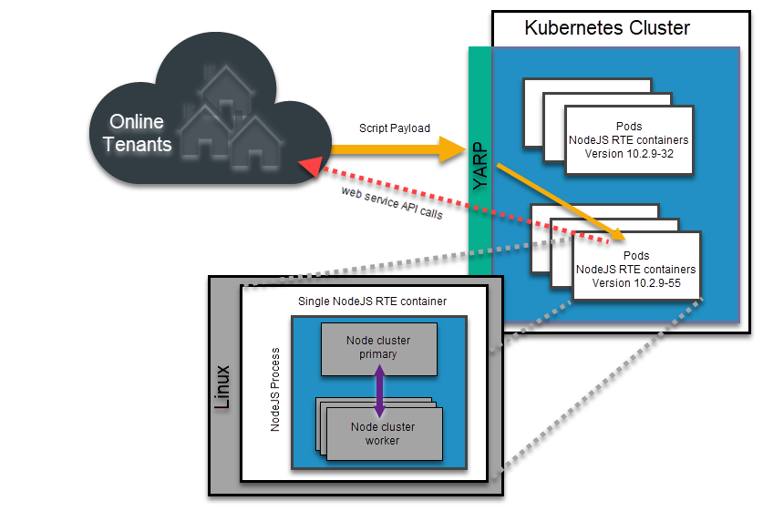

# CRMScript 2.0 Online Architecture

This document describes the architecture of the CRMScript 2.0 online environment. It is intended for developers who want to understand how the online environment works.

## Overview

1. Upon execution of a CRMScript2 by a tenant, an HTTP request is dispatched to the CRMScript2 Service within the Kubernetes environment.

2. YARP determines the version currently in use by the tenant. Subsequently, the request is routed to a Service that operates the corresponding version of the RTE (CRMScript2 Run-Time Environment).

3. The targeted container initiates a node application. This application leverages the Node Cluster module to efficiently distribute incoming requests to an appropriate worker.

4. Once received, the worker decomposes the request into several components: the JavaScript intended for execution, context variables (such as EventData), and NetServer connection details. Following this, the JavaScript is executed. During its operation, the JavaScript might interface with the NetServer API. Upon completion, a context object is returned, encompassing output, EventData, tracing, and other relevant information.

5. Post-execution, the worker process is terminated. The primary process then generates a new worker process. This new worker undergoes initialization, which includes loading the RTL (Run-Time Library), and subsequently prepares to handle incoming requests.
